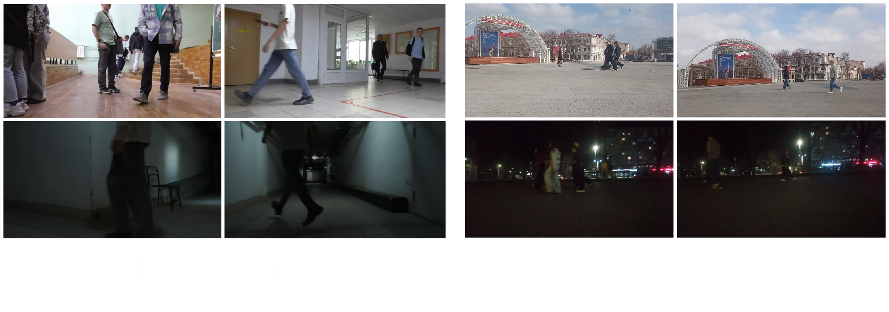
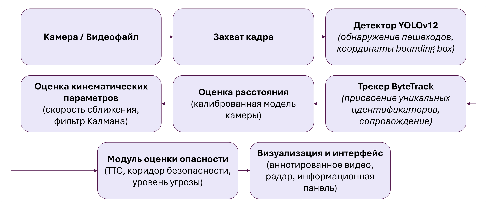
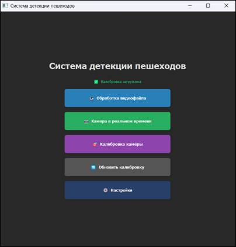
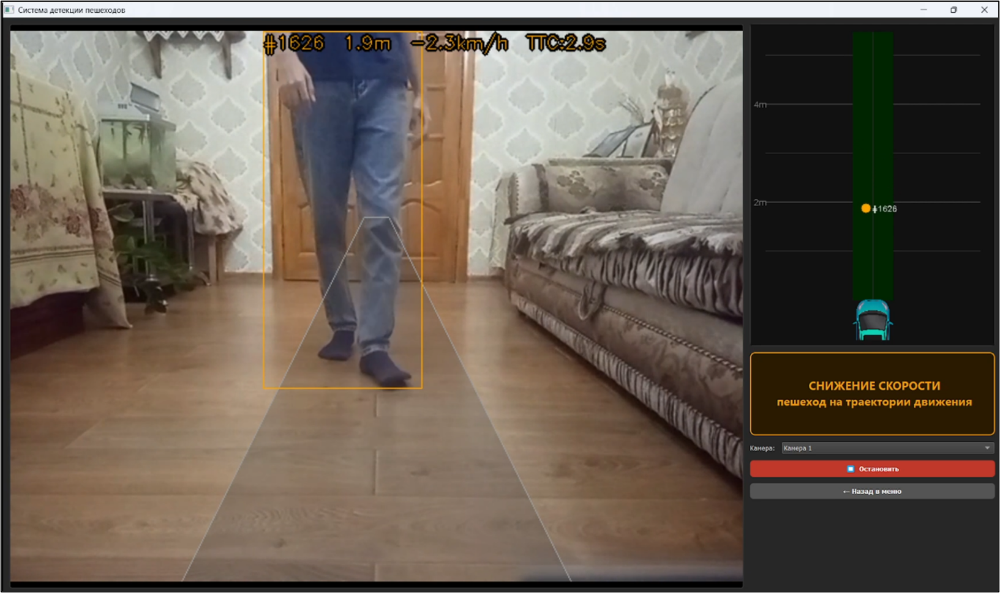
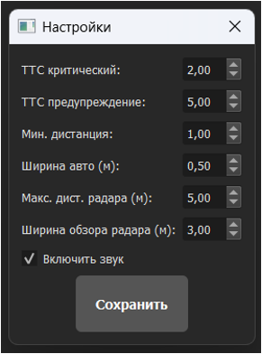

# Система мониторинга дорожной обстановки для беспилотного автомобиля

## Описание проекта

Данный проект разработан в рамках выпускной квалификационной работы **«Задачи безопасного движения беспилотных автомобилей при наличии пешеходов»**.

Цель работы — создание системы контроля дорожной обстановки для беспилотного автомобиля, способной в режиме реального времени:

* обнаруживать пешеходов на видеопотоке;
* оценивать расстояние до них с использованием одной камеры;
* сопровождать объекты между кадрами;
* вычислять скорость сближения;
* прогнозировать вероятность столкновения;
* определять уровень опасности дорожной ситуации;
* визуализировать окружающую обстановку с помощью радара.

В качестве детектора объектов используется обученная модель **YOLOv12**, выбранная по результатам сравнительного исследования моделей YOLOv12, RT-DETR и SSD MobileNetV3.

## Основные возможности

### Детекция пешеходов

Система обнаруживает пешеходов на изображении и отображает:

* ограничивающие рамки (Bounding Boxes);
* уникальный идентификатор объекта;
* расстояние до пешехода;
* скорость его движения относительно автомобиля.

### Калибровка камеры

Реализован отдельный модуль калибровки, позволяющий вычислить параметры камеры и получить возможность оценки реального расстояния до объектов по изображению.

Результаты калибровки сохраняются в файл:

```text
calibration.json
```

### Трекинг объектов

Для сопровождения пешеходов между кадрами используется алгоритм трекинга, обеспечивающий стабильные идентификаторы объектов.

### Фильтрация измерений

Для подавления шума применяется:

* фильтр Калмана для расстояния;
* экспоненциальное скользящее среднее (EMA) для скорости.

### Оценка опасности

Для каждого пешехода вычисляется показатель:

**TTC (Time To Collision)** — прогнозируемое время до столкновения.

На основе TTC формируется один из уровней опасности:

| Уровень | Описание                |
| ------- | ----------------------- |
| 0       | Безопасно               |
| 1       | Потенциальная опасность |
| 2       | Критическая опасность   |

### Радар дорожной обстановки

Дополнительно отображается радар, показывающий положение пешеходов относительно автомобиля в метрической системе координат.

## Используемый датасет

Для обучения моделей был собран собственный датасет.


Видеоматериалы снимались:

1. Внутри учебного корпуса:

   * коридоры;
   * аудитории;
   * дневное освещение;
   * слабое освещение.

2. В городской среде:

   * пешеходные дорожки;
   * площади;
   * дневные сцены;
   * ночные сцены.

### Особенности съемки

* разрешение камеры: **1280×720**
* высота установки камеры: **0.5 м**
* имитация расположения камеры на беспилотном автомобиле

### Подготовка данных

Из видео были извлечены отдельные кадры с помощью FFmpeg.

Разметка выполнялась в системе **CVAT**.

### Итоговый состав датасета

После аугментации ночных кадров датасет содержит:

| Выборка    | Количество изображений |
| ---------- | ---------------------- |
| Train      | 7757                   |
| Validation | 1661                   |
| Test       | 1661                   |
| Всего      | 11079                  |

### Формат разметки

Используется формат:

```text
Ultralytics YOLO Detection 1.0
```

Аннотации содержат:

* класс объекта (Pedestrian);
* координаты ограничивающей рамки.

## Архитектура системы

Обработка каждого кадра выполняется последовательно:



# Установка и запуск

## 1. Создание виртуального окружения

### Windows

```bash
python -m venv venv
venv\Scripts\activate
```

### Linux

```bash
python3 -m venv venv
source venv/bin/activate
```

## 2. Установка зависимостей

```bash
pip install -r requirements.txt
```

## 3. Запуск приложения

```bash
python app.py
```

После запуска откроется графический интерфейс системы.

# Главное меню


Данное окно предоставляет доступ ко всем основным функциям системы.

## Калибровка камеры

Позволяет:

* загрузить фотографию;
* отметить контрольные точки;
* вычислить параметры камеры;
* сохранить результаты в `calibration.json`.

Перед использованием системы данный этап необходимо выполнить хотя бы один раз.

## Обработка видеопотока



В режиме реального времени отображаются:

* обнаруженные пешеходы;
* расстояние до них;
* скорость сближения;
* уровень опасности;
* радар дорожной обстановки.


## Обработка видеофайла

Позволяет загрузить заранее записанное видео и выполнить его анализ.

Результат обработки отображается аналогично режиму работы с камерой.

## Настройки


В окне настроек доступны параметры:

* TTC_WARNING - временной интервал (в секундах), при котором система классифицирует ситуацию как потенциально опасную (Уровень 1);
* TTC_CRITICAL - минимально допустимое время до столкновения (в секундах), переход к Уровню 2;
* DIST_MIN - физическое расстояние в метрах (например, 1.0–1.5 м), ближе которого нахождение пешехода запрещено вне зависимости от его скорости;
* CAR_WIDTH_M -  реальная ширина транспортного средства в метрах;
* дальность радара - максимальное расстояние в метрах, которое отображается на графическом радаре.

Настройки позволяют адаптировать систему под различные типы транспортных средств и условия эксплуатации.


## Структура проекта

```text
final_qualifying_work/
│
├── app.py                     # Главный файл приложения (точка входа)
├── shared.py                  # Общие функции и константы проекта
├── settings.json              # Пользовательские настройки системы
│
├── camera_calibration/        # Модуль калибровки камеры
│   ├── camera_calibration.py  # Интерфейс и логика калибровки
│   └── calibration.json       # Рассчитанные параметры камеры
│
├── dataset/                   # Пользовательский датасет (необходимо загрузить в проект)
│   ├── images/                # Изображения
│   ├── labels/                # Аннотации в формате YOLO
│   └── data.yaml              # Конфигурация датасета
│
├── neural_networks/           # Обучение и сравнение моделей
│   ├── yolov12/               # Материалы и веса YOLOv12
│   ├── rf_detr_nano/          # Материалы и веса RT-DETR
│   ├── ssd_mobilenetv3/       # Материалы и веса SSD MobileNetV3
│   ├── comparison_results/    # Результаты сравнения моделей
│   └── comparison.py          # Скрипт сравнения метрик моделей
│
└── materials/                # Ресурсы интерфейса
```

